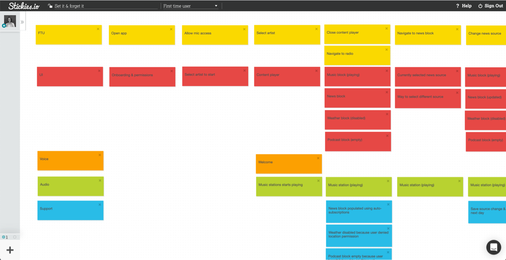
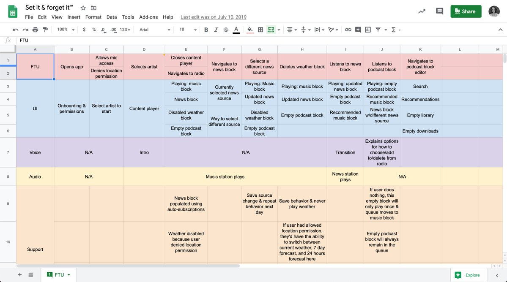

At Spokestack, we use [experience mapping](https://spokestack.io/docs/Design/map-out-integration) as a tool to formulate multimodal flows for our products based on [researched observations and ideas](https://spokestack.io/blog/user-research-for-voice-experiences). It’s a great way to get everyone on the same page before designing or building anything. Plus, it forces us to consider _what_ exactly we want users to ask and _how_ we’ll respond, both conversationally and visually. When our team committed to being 100% distributed over two years ago, I wanted to recreate this exercise digitally. What I came up with follows many of the same steps outlined in our [design docs](https://spokestack.io/docs/Design/getting-started). However, the tools and set-up are a bit different. Here are a few considerations to keep in mind when adopting this exercise.

## Tools We Use

I use [Zoom](https://zoom.us/) to screen share and record conversations with my team. Meeting recordings are a good reference point if you or a teammate needs to be reminded of how decisions were made and why. You’ll still need to designate someone to lead and record the map. That person will need to screen share documentation while mapping and record the meeting. For our team, I’m usually the designated leader. I use one of two tools (both free) for mapping:

### Stickies.io

[Stickies.io](https://stickies.io/) does a great job mimicking the tactile nature of mapping with post-it notes (and, without the clean up). Create a new “board” for each project. If your project requires more than one experience map (i.e. if you’re mapping for new and return users), you’ll need to create a new sheet for each in the top nav. Use stickies here like you would post-it notes in a conference room. List actors along the left axis. The bottom axis will represent time. Pick a starting point and list each action on a separate sticky in the same color as the corresponding actor.

<figure>

<figcaption>Here's an example of an experience map for Radiobrain created using Stickies.io</figcaption>
</figure>

### Shared spreadsheets

These are equally great if not more so for complex maps that capture lots of actions and actors. Create a new spreadsheet for each project. Use tabs to keep track of multiple experience maps where necessary. Use cells here like you would post-it notes same as you would above and make sure that they are color coded accordingly. Unlike stickies.io, if an action is reoccurring across the x axis, you won’t need to repeat that cell.

<figure>

<figcaption>Here's an example of the same experience map from Stickies.io recreated using Google Sheets.</figcaption>
</figure>

> Not sure where to start? Here’s a [template](https://docs.google.com/spreadsheets/d/1epKA1i_2Cbb8sCEnV_D1mHl4VHfdJhY7-EXZGIrPjbM/edit?usp=sharing) using Google Sheets to get you started. Make sure to duplicate this document before making any changes.

For more tips on designing multimodal voice experiences, visit the [design](https://spokestack.io/docs/Design/getting-started) section of our documentation.
