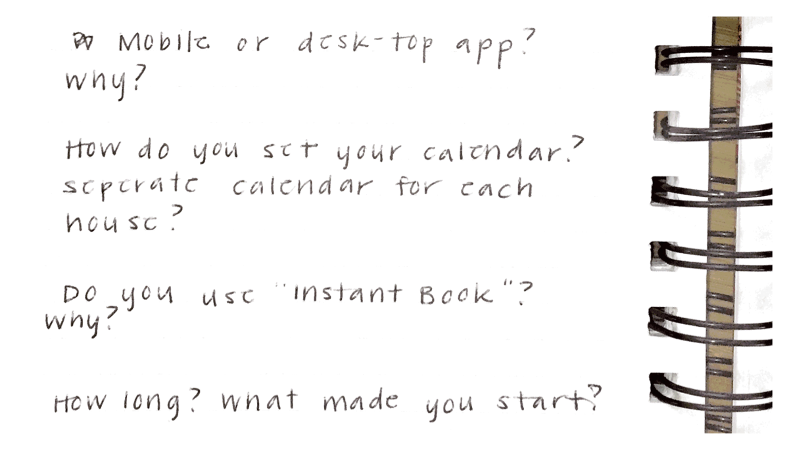
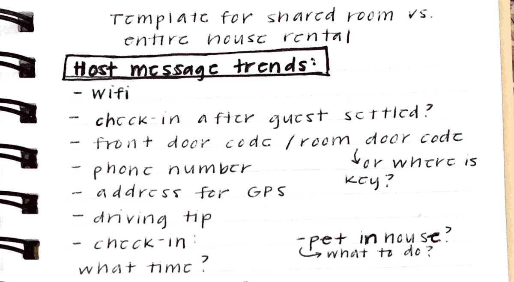

Over the last three years, I’ve worked on designing voice and chat conversations paired with mobile UIs including [The Bartender](https://www.thebartender.io) and [Tasted](https://www.tasted.com). One thing has remained clear: design for verbal input is a very different UX problem. The number of actions a user can take is not constrained by buttons and navigational menus. That’s why it’s important to start every project by identifying who exactly you’re designing for. This will help you better understand how voice can improve your overall experience.

## "What can I help you with?"

If you’ve ever said “Hey Siri” to an iOS device, you're likely familiar with the assistant’s opening screen. “What can I help you with?” can be intimidating. You might not be sure what or how Siri can help you, if at all. Siri serves a broad audience (every iPhone user in the world) and an even broader domain of knowledge similar to a search query, which can be overwhelming. [Independent Voice Assistants](https://spokestack.io/blog/what-is-an-independent-voice-assistant) (IVA) serve a more limited domain of knowledge. The actions a user can take, or “intents,” focus on specific tasks in your app like buying movie tickets, recording a run, or finding a cocktail recipe.

With fewer intents, your assistant can provide a better experience without having to know how to respond if a user asks something unrelated like “How many miles to the moon?” But, what intents _do_ \*\*your users care about? To answer that question, you need to start by understanding who you’re building for. Even if you already have an idea of who your target audience is, adding a voice assistant to your mobile app may shift your product’s reach.

## Identify how users talk about what’s important to them

Take a step back at start of a project and consider what’s most important to your intended audience. What are they trying to accomplish? How can voice make tasks easier? This will help you decide how a voice assistant can improve your app’s experience.

If you don’t know the answers to these questions, it’s ok. I’m going to help you seek these out before diving into product specifics by gathering anecdotal insights. And, if you’re starting a new project that hasn’t been built yet, that’s ok too. This process can be adopted to gain insights for concepts, prototypes, and/or real-world examples. It’s important you start this discussion early in the process and keep it ongoing.

<figure>

<figcaption>Above are some questions I brainstormed with my team for an initial proof of concept. We wanted to better understand the pain points of managing AirBnBs.</figcaption>
</figure>

## Recruit from your network

Relying on your network can be a great way to quickly get initial feedback. Use a survey to gather demographic information on candidates, even old friends. Here are some tips that have helped me during recruitment:

1. Allow yourself at least a week to schedule one-on-one time with each person. Following [Jakob Nielsen’s advice](https://www.nngroup.com/articles/how-many-test-users/), I’ve found success limiting this to around five people.
1. Share a calendar link. I’ve found [Calendly](https://calendly.com/) and [Google Calendar](https://calendar.google.com/) to work well for this. Be sensitive of their time and schedule. Make it easy for them to talk to you.
1. Offer your subjects an incentive if you’re able. We often give our participants gift cards for example.

## How to guide the discussion

This will be a guided discussion that you will take charge of. It’s important to come prepared. Here are a three things I make sure to do prior to an interview:

1. Create a document for each person you interview that includes background information from an email correspondence or survey results. Leave room to jot down questions during your interview. Getting feedback from your users usually happens fast during an interview or usability test. You’ll have time to take more in-depth notes later. Here’s a [template](https://docs.google.com/document/d/15YtXuLhlOKrNa6m9ElFBuG-O2ppCc4obVlivl4Dhqfk/edit?usp=sharing) I usually use for this.
1. Write a script that provides a framework for your conversation, but improvise as you see fit (see the next section). Include instructions and questions. Here’s a [sample script](https://docs.google.com/document/d/1KdaeVRv1nlvMvZTMyglkvuv8EG8z6Lcv8Ca9-oLUkjY/edit?usp=sharing) I adopted from Steve Krug’s [_Rocket Surgery Made Easy_](https://www.amazon.com/Rocket-Surgery-Made-Easy-Yourself/dp/0321657292) that helps me stay on task during interviews.
1. It will feel silly, but it really helps to rehearse your script by doing a dry run. Have someone pretend they’re the user and read the script aloud to them. This will help iron out any kinks that may remain (and ease any pre-interview jitters).

## Don’t forget who your real users are (psst, it’s not you!)

You may be more savvy about voice assistants or tech in general than your audience. It’s hard to step back and really hear what users are saying when you’re eager to start designing or building a product. Ask interviewees how they would normally complete certain tasks. Observe their language including nouns, verbs, and sentiment. Your users' natural speech will inform which utterances and intents your assistant supports and how you’ll prompt these. Be on the look out for any contextual clues that might reveal how or where they’re completing these tasks. Voice interfaces allow certain tasks to be completed while multitasking. Use this to your advantage.

Here’s an example from a user interview I did for a virtual host concept for AirBnb hosts. An owner I spoke with had a complicated coffee maker in one of his units. He had made a binder full of useful tips for his guests that explained how to use his appliances. However, housekeeping often misplaced the binder making it hard for his guests to find. A simple “how does the coffee maker work?” to a voice assistant followed by step-by-step instructions could satisfy the problems of both the owner and guest.

If candidates feel comfortable, stream and record the discussion (we use [Zoom](https://zoom.us/)). This will allow your team to ask questions in real time.

## Post-interview

After the interview, I like to use recording to document takeaways by doing the following:

1. Write down observations and transcribe any statements that stood out to you after listening to your discussion a second time.
1. Discuss and group reoccurring insights with your team.
1. Label each group to reflect a product feature or intent.
1. Let your observations guide the level of priority for each. Which intents will most ease the user’s experience? This will dictate focus when you start to map your multimodal flow.

<figure>

<figcaption>After sharing my observations from Airbnb hosts with the team, here are some trends we identified.</figcaption>
</figure>

Don’t forget to re-visit this discussion as needed throughout the design process, especially when testing a product’s usability, to determine if what you’re building remains relevant to your intended audience. In further posts, I will show you how to take this research and turn it into a great voice user experience.

For more help designing independent voice assistants, visit the [design](https://spokestack.io/docs/Design/getting-started) section of our documentation.
