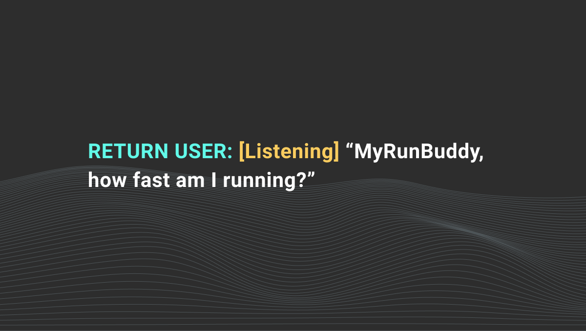
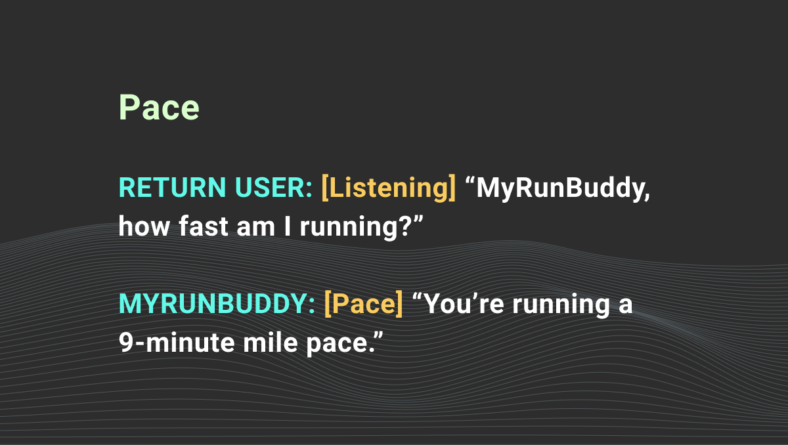

The next step after creating an [experience map](map-out-integration) is to focus on what will be said verbally. A script outlines sample dialog, both verbal and nonverbal, between a multimodal app and the user. This will include both what your app will say and do. Your script will help frame context for your responses and lay the groundwork for how intents are designed. A single back-and-forth interaction between an app and the user represents a single turn. Your script will represent dialog for the turns you defined previously in your experience map.

## How to Write a Script

#### 1. Start by Setting the Scene

Refer back to your experience map’s starting point and provide additional context for your actors. Format contextual clues in italics. Consider including answers to the following:

- Where is your user?
- What might they be thinking?
- What are they trying to accomplish?
- Where are they currently in the flow?
- What’s happening, both in app and their surrounding environment?
- Have they granted the necessary permissions?

Here’s an example:

> The user has gone through onboarding and has their microphone on. They are familiar with using the app including voice commands. In this scenario, the app is open in the background on their phone. They are currently in the middle of a recorded run with their phone in an armband. To speak to the fitness tracker, they move their arm towards their face.

#### 2. Write a User Intent or Gesture

Give your user a clear label. Be descriptive. Specify whether your user is new or returning. Treat this like you would any other script by bolding the user’s name followed by a colon. Use “quotes” to differentiate between user utterances and gestures. Use any natural language observed during [user research](/blog/user-research-for-voice-experiences) to craft utterances. Describe what you would expect to happen on the screen visually in [square brackets]. Keep these broad and don’t make any specific UI decisions at this point.

Here’s an example:

#### 3. Write a Response

Focus on the conversational aspect of your response for now. Again, make note of any corresponding visuals in [square brackets] and keep these high level. We’ll get to more specifics on [nonverbal cues](tips-for-designing-visual-output) later. Consider how you’ll educate and engage your users by answering the following:

- How will users know what they can say?
- How will you confirm information?
- How will they know the interaction has successfully ended?

Write using an informal tone to avoid sounding stilted. Always be thinking how you would respond if a friend asked you the same thing on the street. If your app is instructional or task-based, break up information into separate responses. Refer to [best practices](tips-for-writing-dialog) if you get stuck. Label each turn or group of turns with a corresponding intent. Note any assumptions and remaining questions you have below each turn.

#### 4. Continue Through Your Experience Map

Repeat steps 2-4 until you’ve exhausted your map. At this point, your script should represent your conversation’s happy path.

Write any variations to your responses without changing meaning, especially for those that users will hear frequently. Variety can help users pay closer attention to what’s being said while also giving your assistant more personality. Include different utterances for the same intent. This will increase the likelihood that your natural language understanding (NLU) system can correctly infer user intent and help your app avoid dead ends.

#### 5. Look Back at Your List of Intents and Include Alternate Paths

Write turns for anything outside this flow. What could go wrong? Consider including answers to the following:

1. How will you respond if you’re unable to match a user’s utterance with an intent?
1. How will you respond if a user responds to a question with a negative?
1. How will you respond to universal intents?
1. How will you drive users back to the app’s main flow?
1. How will your responses differ based on where the user is in the conversation?

Your script is complete once you’ve exhausted both your experience map(s) and list of `intents`. Proofread your script before continuing.

Here’s an [example](https://www.dropbox.com/scl/fi/0weo35v72i901bynq2j8o/MyRunBuddy-MVP-Return-User-PUBLIC.paper?dl=0&rlkey=mzwmhjl00xznfaxxxo17kjjz1) of a drafted script excluding visual output. We’ll get to that in a later step.

## Test and Refine Your Script

This can be accomplished in one of two ways:

#### Conduct Table Reads

Read your script out loud with someone else. Have one person read for your app and the other for the user. Consider if your interaction sounds human and natural. You might find awkward wording when you read the script out loud. Assess each response using the [one-breath test](https://developer.amazon.com/en-US/docs/alexa/alexa-design/relatable.html). That is, can you comfortably read each response at a normal pace without taking a breath? If not, consider condensing responses.

#### Have a Synthetic Voice Read Responses

[Create an account or sign-in](/create) and navigate to the “text-to-speech” section of your account. Type responses in here to hear how a synthetic voice might read them. It’s important to listen for how your responses are pronounced as well as the speed with which they are read. Pay attention to comma, period, and space placement. These have a big impact on how synthetic voices interpret responses.

## Introduce Visuals

Now that you’ve established what you’re going to say, it’s time to make [UI decisions](tips-for-designing-visual-output). The process of iterative design and prototyping used for visual design without voice still applies. We use [Sketch](https://www.sketch.com/) to wireframe and mock up ideas. Export screens from your tool of choice and pair them with corresponding turns. Create a prototype if it’s helpful. [Adobe XD](https://www.adobe.com/products/xd.html) is the best option we’ve found for prototyping with voice.
