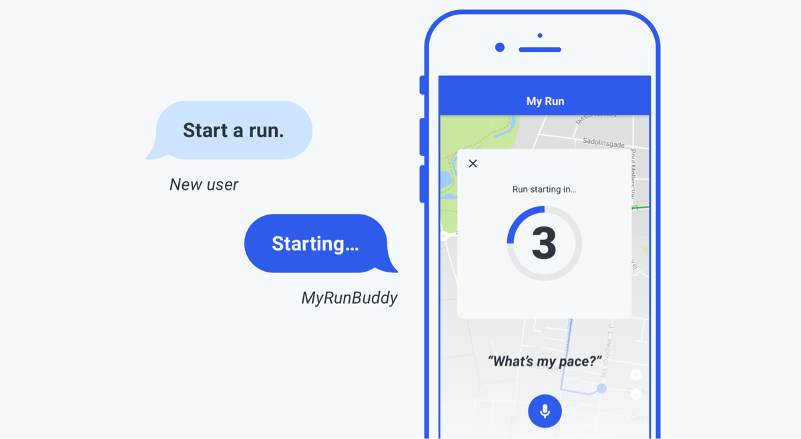
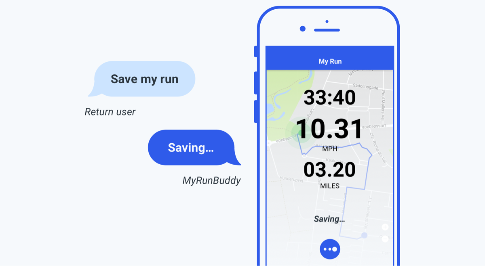
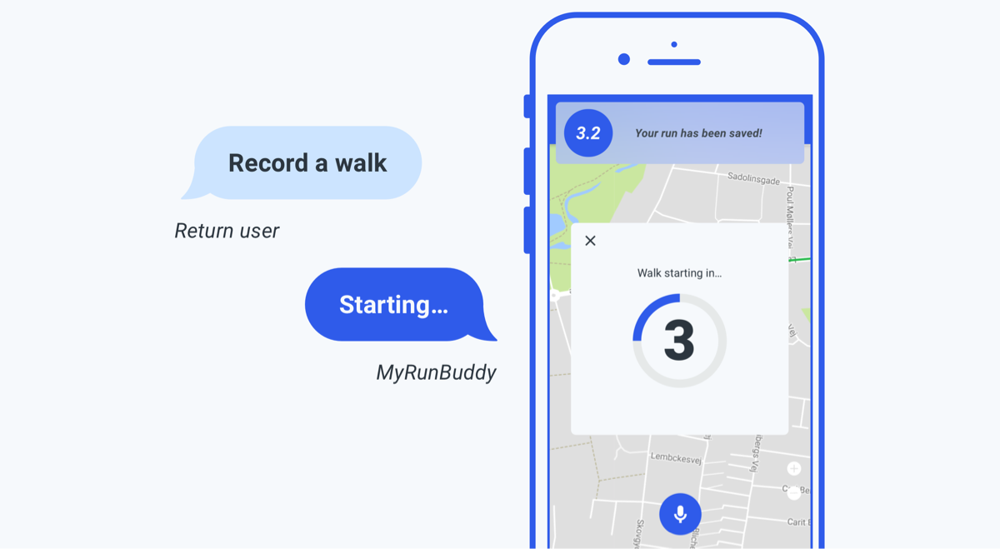
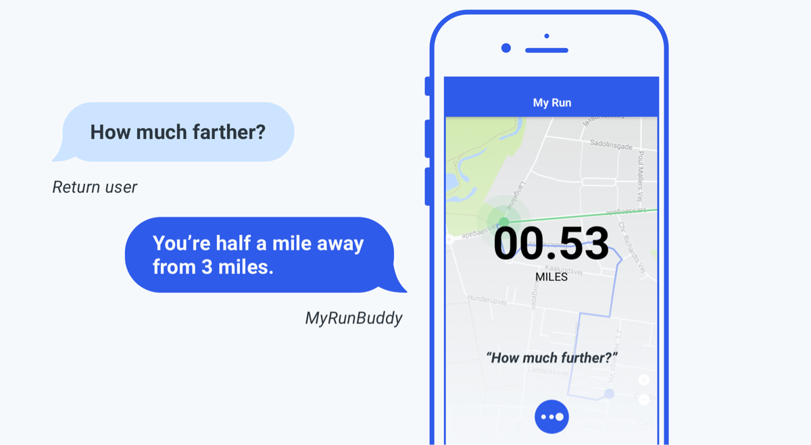

The goal of any good experience designer is to reduce cognitive load on the user wherever possible ([golden rule #8:](https://www.cs.umd.edu/users/ben/goldenrules.html) “reduce short-term memory load”). We as humans are incapable of remembering [more than seven items at any given time](https://en.wikipedia.org/wiki/The_Magical_Number_Seven,_Plus_or_Minus_Two). With these limitations in mind, consider how visuals can reduce friction and eliminate confusion. What should you supplement dialog outlined in your script with?

While much has been written about conversational design, few standards exist for how to integrate visuals with independent voice assistants (IVA). These best practices draw from user experience (UX) design as well as from our own professional experiences. You might recognize some of these best practices from Ben Schneiderman’s [_The Eight Golden Rules of Interface Design_](https://www.cs.umd.edu/users/ben/goldenrules.html).

## Use nonverbal visual cues to clarify communication

How would a friend communicate that it’s your turn to talk? You’d likely rely on their body language or facial expressions. For example, they might pause and/or maintain eye contact. Hand gestures facilitate both [speech fluency and accuracy](https://vimeo.com/410056595). With multimodal experiences, this nonverbal communication is accounted for in the UI. For instance, it’s ok if something takes longer to process something so long as you clearly communicate the delay in action ([golden rule #3:](https://www.cs.umd.edu/users/ben/goldenrules.html) “offer informative feedback”). Without a visual cue, a user could misinterpret silence as an error or need for additional information. We’ll describe different types of nonverbal cues in the sections that follow.

## Include a touch-to-talk button, even if your app is wake word enabled

Hardware limitations may limit your ability to have your service work the way you want it to with wake word only voice activation. Touch-to-talk allows users to invoke listening by touch instead. Here are some considerations to keep in mind:

- Make sure touch-to-talk is accessible one-handed. Especially if your target demographic might use your app while in the car.
- Don’t make your button discrete or hide it at any point.
- Avoid using a toggle. Many users assume toggles control listening for the wake word, similar to how Alexa works.
- Make sure your button is always in the same place. This way, users will know where to look ([golden rule #1:](https://www.cs.umd.edu/users/ben/goldenrules.html) “strive for consistency”).

## Make sure users know who’s turn it is to talk

This is often referred to as “turn taking.” You want to communicate that you’re listening to the user’s utterance and then that you’re processing what they said.

Use cues that are easy to spot from a distance. For example, Alexa is a voice-only device intended for hands-free, eyes-free communication. And yet, it makes use of an easy-to-spot visual cue: the blue ring. After using the wake word, “Alexa,” the blue ring lets the user know that the device is actively listening to whatever may follow. Once the user’s intent has been heard, the blue ring circles the top of the device signaling to the user that their intent is being processed by the natural language understanding (NLU) system. We refer to this type of animation as “thinking.”

Be judicious with screen real estate by deciding whether visual turn taking should occupy a full or [partial](https://uxdesign.cc/redesigning-siri-and-adding-multitasking-features-to-ios-70c2f1a1569b) screen. Using a full screen to communicate turn taking isn’t always realistic.

## Communicate active listening using an animation

Static cues don’t convey activity in the same way. Here are some things to keep in mind when designing your listening animation:

- Turn on your listening animation the exact millisecond your app is done speaking. This is when users are most likely to speak.
- Make sure your animation lasts the length of a complete user utterance. An animation that ends before the user’s finished talking might communicate that their intent wasn’t heard ([golden rule #5:](https://www.cs.umd.edu/users/ben/goldenrules.html) “prevent errors”).
- Be consistent with placement.
- If your app has a touch-to-talk button, consider including your listening animation here.

## Signal that the app is no longer listening

It’s important to separate the voice assistant _feature_ of an app from the app itself. The voice assistant can control the app, but it only does so at the behest of the user. The only thing it does autonomously is stop actively listening after a pre-set timeout. With this in mind, here are some considerations:

- Identify when the user has finished speaking before ending your listening animation, otherwise known as “endpoint detection.”
- Consider using a visual, sound ([earcon](https://medium.com/vui-magazine/earcons-the-audio-version-of-an-icon-59b7f0921235)), or some combination of both. For example, Siri makes use of a nonverbal audio ‘up’ sound.
- Allow users to end listening using gestures or an `exit` intent.
- If no speech is detected by your automatic speech recognition (ASR) engine, consider how long you’ll wait before turning off listening. Consider reminding users what they can say visually (see next section). For example, Alexa’s blue ring turns off after 8 seconds. On the other hand, Google Assistant and Siri show a help screen with sample intents after 5 seconds.

## Remind users how they can continue or pivot the conversation

If screen real estate permits, consider including visual prompts (Google refers to these as “[suggestion chips](https://developers.google.com/assistant/conversational/rich-responses#suggestion_chips)”). This will help users remember what they can ask, even when unprompted. Take into account the context in which your user is using your app and where they are in the conversation. For example, if users are in a situation where they’re unable to view their screen, visuals might not be as useful. When designing visual prompts, consider the following:

- Limit yourself to one or two intents. Providing too many options can distract users from the task at hand.
- Make sure to include “quotes” with any visual suggestions.

In the example below, introducing visual cues for intents when a user is recording a run for the first time might not be useful.

## Offer multiple modalities for input (and, to correct input)

Recognize that some information may be better heard; other information might be better seen ([golden rule #2:](https://www.cs.umd.edu/users/ben/goldenrules.html) “seek universal usability”). Providing multiple ways of accomplishing the same task can provide a better experience, especially when handling errors with your ASR engine. For example, Siri provides “tap to edit” below the user’s utterance on the screen.

Here are a few other considerations to keep in mind:

- Allow alternative modes for inputting strings of numbers or detailed information that can tedious to say out loud such as phone numbers and zip codes.
- Take into account users with accessibility needs.
- Give users the option to hear or see requested information ([golden rule #7:](https://www.cs.umd.edu/users/ben/goldenrules.html) “keep users in control”).
- Clarify how users will receive output by labeling visual inputs with corresponding actions like “see,” “hear,” “show me,” “tell me,” etc.
- Keep in mind the mode of users’ interactions and respond accordingly. If a user responds using gestures, they might not expect to hear a response. For example, imagine if every time you hit the home button on your iPhone by accident, you heard Siri talk. That might get old quick.
- Consider displaying ASR results, especially for longer utterances that may be easier to repair by typing. For example, a search query.
- If you need to use a follow-up, supplement with visuals.

In the example below, the app asked a follow-up and the user responded by tapping a button. The mic would stop listening once the user interacts using gestures thereby ending the conversation. If the user said “yes,” you could confirm their intent by highlighting the save button as if the user had tapped it. This can prove to be especially useful for fixed feedback such as yes and no.

## Provide enough information to properly orient users, but don’t distract them

It’s important to keep the conversation moving and quickly allow users to confirm whether or not they’re on a path to success ([golden rule #3:](https://www.cs.umd.edu/users/ben/goldenrules.html) “offer informative feedback”). Here are some things to keep in mind:

- Confirmations need to be small, legible, and in a color palette that doesn’t interfere.
- Avoid colors that convey immediacy.
- Follow the same rules you would for [designing notification](https://www.nngroup.com/articles/push-notification/)

For this example, the app could either choose to a) implicitly end the run and save it or b) tell the user they have a run in progress and ask if they want to stop & save. The user then recorded a walk. Once saved, the user received visual confirmation.

## Format information for quick retrieval, emphasizing utility over complexity

Memory and processing are [fundamentally different](https://link.springer.com/article/10.3758/s13423-019-01597-7?shared-article-renderer) visually and aurally. Consider certain GUI components like a menu, a list of names, or a billing statement—all are easy to browse visually, but would be painful to hear read aloud.

Here are some things to keep in mind:

- Display lists visually instead of reading them out loud ([golden rule #8:](https://www.cs.umd.edu/users/ben/goldenrules.html) “reduce short-term memory load”). This puts the user back in control by allowing them to focus on information relevant to them. They can skip items they don’t care about as well as review and decide at their own pace ([golden rule #7:](https://www.cs.umd.edu/users/ben/goldenrules.html) “keep users in control”).
- Consider opening a different screen if requested information isn’t already available.
- Don’t overcomplicate output for a complex query.
- Display or summarize key information that is relevant to the user’s intent and allow them to learn more if they choose.

In this example, the user requested information that wasn’t already on the screen. As a result, the screen reformatted information to match the user’s request.

